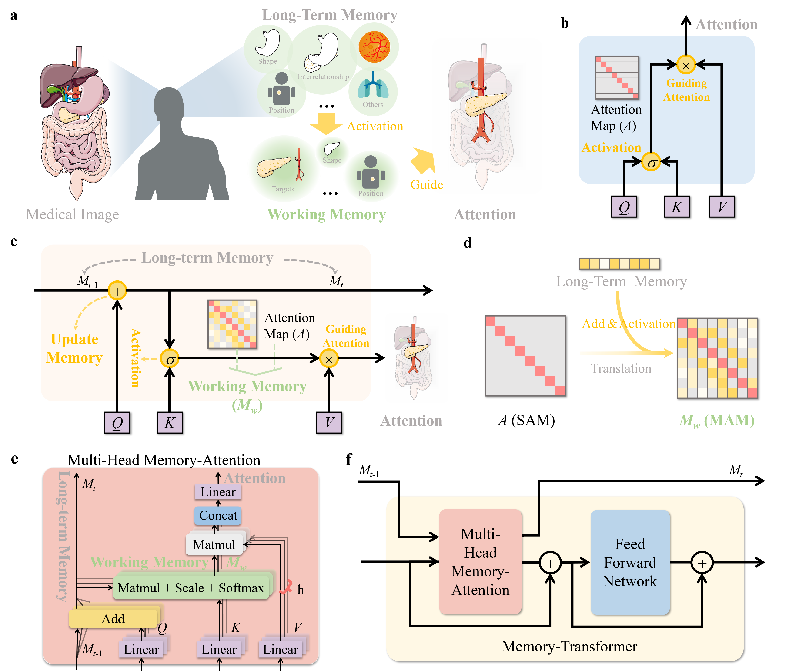
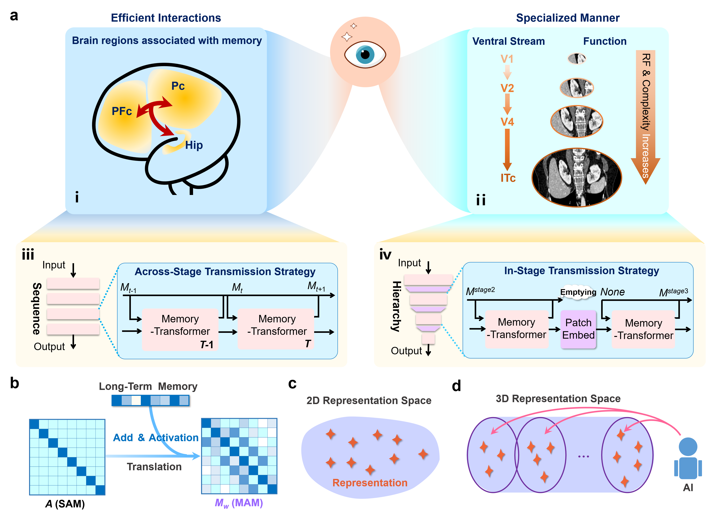
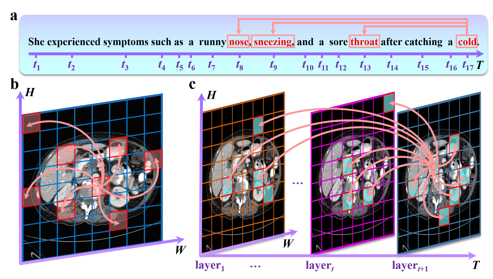

# Memory-Attention
This is the code base for **`"Making your visual deep neural networks remember more information"`**, and the article is submitted to **`Nature Communications`**.

In this work, we explore integrating abstract **cognitive theories** into the **modeling process of visual DNNs** from a computational perspective. Inspired by **MCWMM**, we introduce a pioneering **Memory-Attention Mechanism (MAM)**, which models for the first time **the bootstrapping effect of working memory representations on visual attention** in visual DNNs, empowering visual DNNs to **model time-scale representations**. Notably, the high **topological design** of MAM allows it to `seamlessly replace the SAM in any expert model, inheriting the pre-trained weights of the SAM`. This feature greatly simplifies the **integration and optimization of the model**, enhancing its **practicality and efficiency**. 

## Abstract
MAM's strengths are attributed to four points: 

(i) **` MAM successfully models abstract long-term memory and working memory into representations that allow for computation`**. 

(ii) **` Inspired by WCWMM, MAM constructs a memory architecture that maintains information within the model's pipeline over time, thereby innovatively incorporating the ability to model time-scale representations within visual DNNs`**.

(iii) **` MAM bases its modeling on visual cognitive processes and successfully implements top-down guided attention from memory in visual DNNs.`**.

(iv) **` MAM exhibits an excellent topology, enabling seamless replacement of SAM in any expert model, utilizing its pre-training weights`**.`see Fig1 to Fig3`.

This study does not prove that the abstraction approach to MCWMM in MAM is optimal. However, through scientific design and comprehensive ablation experiments, we hope to demonstrate that abstract cognitive theories can serve as a guideline for model design, accelerating the interaction and integration of cognitive psychology and AI and inspiring the exploration of the intersection between other abstract disciplines with AI. Furthermore, our experimental findings indicate that a model's design significantly contributes to its performance when aligned with human cognitive mechanisms. This design philosophy prompts the model to exhibit alignment with human cognition in specific capabilities.

## Results
**To learn more detail please read our paper**.
### Comparison experiments
The results of the quantitative comparison between the SAM-based model and the MAM-based model are in the Task 1 (Synapse dataset). `Notice that here we only show part of the experimental results, for the complete experimental results please refer to our paper.`

The results of the Task 1.
| Methods  | DSC(%)↑ | HD(mm)↓ | Aorta(%) | Gallbladder(G)(%) |  Kidney(L)(%) | Kidney(R)(%) | Liver(%) | Pancreas(%) | Spleen(%) | Stomach(%) |
| :---: | :---: | :---: | :---: | :---: | :---: | :---: |  :---: | :---: | :---: | :---: |
| Swin-Unet | 77.6	|25.2|	86.2|	66.4	|82.3	|75.4	|93.9	|56.4	|88.4	|71.7|
| Swin-Unet-MAM | 78.6|	23.1	|85.6	|63.6	|84.5	|79.7	|94.0	|58.6	|89.7	|73.4|
| DA-TransUnet | 79.6|	29.1|	87.3|	62.6|	83.1|	79.9|	94.3|	63.3|	86.6|	79.5|
| DA-TransUnet-MAM | **80.9**|	**25.0**|	87.4|	64.6|	84.6|	82.1|	94.8|	63.2|	89.5|	81.0|

The results of the Task 5 - 3D (FLARE 2021-3D) dataset.
| Methods  | #param(M) | FLOPs(G) | DSC(%)↑ | Spleen(%) |  Kidney(%) | Liver(%) | Pancreas(%) | 
| :---: | :---: | :---: | :---: | :---: | :---: | :---: |  :---: |
| nnFormer | 149.3	|240.2	|88.7	|97.3	|94.9	|94.9	|67.6|
| nnFormer-MAM | 149.3|	240.2|	89.9|	97.2|	95.5|	96.8|	70.1|
| SwinUNETR | 62.2	|328.4	|92.7	|97.7	|95.9	|96.9	|80.3|
| SwinUNETR-MAM |62.2	|328.4	|93.3	|97.8	|96.5	|97.3	|81.6|

### Ablation experiments

**To learn more detail please read our paper**.

 We conducted a detailed ablation investigation on each important memory concept MAM gave to verify its scientific validity properly. At the same time, we demonstrate that **the memory mechanism in MAM is essentially different from the residual connectivity mechanism in terms of the sensitivity of the data distribution**. `Notice that here we only show part of the experimental results, for the complete experimental results please refer to our paper.`

The results in the ablation experiment 5.
  | Memory Transmission Strategies  | Label | Encoder | Decoder | #param(M) |  FLOPs(G) | DSC(%)↑ | HD(mm)↓ | 
| :---: | :---: | :---: | :---: | :---: | :---: | :---: |  :---: |
| No MAM | Baseline 5	|-	|-	|41.3	|8.7	|77.60	|25.19|
| STS | Model 5-1|	√|	-|	41.7	|8.8|	77.68	|23.94|
| STS | Model 5-2	|√	|√	|44.4|	9.1	|76.74	|23.96|
| ISTS |Model 5-3	|√|	-	|41.3	|8.7	|78.63	|23.12|
| ISTS |Model 5-4	|√	|√	|41.3	|8.7	|78.17	|23.54|

 

## Train and Test
We have provided detailed instructions for model training and testing and experimental details. You can click the link below to view them.
* [DA-TransUnet-MAM ](DATransUnet-MAM/)
* [SwinUnet-MAM ](SwinUnet-MAM/)
* [SwinUNETR-MAM & nnFormer-MAM ](SwinUNETR&nnFormer-MAM/) 

## Citation
