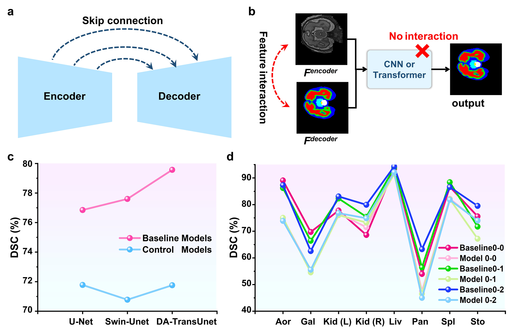

# Recurrent-Attention
This is the code base for **`"Recurrent-Attention: A robust neural network operator for medical image segmentation"`**, and the article is submitted to **` Medical Image Analysis`**.

## Abstract
Accurate medical image segmentation is crucial for computer-aided clinical diagnosis, treatment planning, and intervention. With the advancement of deep learning, expert models based on **Self-Attention (SA)** have become widely utilized in medical image segmentation tasks, including X-rays, CT scans, and MRIs, owing to their exceptional ability to model global dependencies. However, **SA is not specifically designed for medical image segmentation tasks**. Therefore, pure Transformers or hybrid Transformer-CNN models inherit the disadvantage of SA's limited ability to model detailed features, `resulting in mis-segmentation`, particularly when dealing with tiny or morphologically irregular organs or lesions. Moreover, when dealing with medical images that exhibit significant variations in modality and disease, **constructing different model architectures relies on experts' empirical knowledge**, `resulting in limited generalisability`. Therefore, in this study, **we first elucidated and demonstrated the critical role of feature interaction capability in enhancing the fine segmentation performance of expert models in medical image segmentation tasks**. **Inspired by recurrent neural networks, we innovatively designed a general and robust neural network operator named Recurrent-Attention (RecA).** RecA builds a pipeline that can continuously maintain and pass the processing feature flow within the model by introducing the recurrent connection, covering the global dependency modeling capability from a single-layer feature map to the whole model, substantially enhancing the extraction of detailed features. Finally, to validate the effectiveness of RecA, we conducted performance evaluations on three widely used 2D public datasets and two 3D public datasets. The experimental results show that **RecA can seamlessly replace SA in existing expert models, significantly enhancing their performance without increasing parameter size or computational complexity**. More importantly, **RecA exhibits outstanding robustness, independent of expert models and input image modalities**. The introduction of RecA not only offers a new and efficient solution for feature interaction in medical image segmentation and holds the potential to become a foundational operator, replacing SA in the next generation of segmentation models. 

## Results
**To learn more detail please read our paper**.
### Comparison experiments
The results of the quantitative comparison between the SA-based model and the RecA-based model are in the Task 1 (Synapse dataset). `Notice that here we only show part of the experimental results, for the complete experimental results please refer to our paper.`

The results of the Task 1.
| Methods  | DSC(%)↑ | HD(mm)↓ | Aorta(%) | Gallbladder(G)(%) |  Kidney(L)(%) | Kidney(R)(%) | Liver(%) | Pancreas(%) | Spleen(%) | Stomach(%) |
| :---: | :---: | :---: | :---: | :---: | :---: | :---: |  :---: | :---: | :---: | :---: |
| Swin-Unet | 77.6	|25.2|	86.2|	66.4	|82.3	|75.4	|93.9	|56.4	|88.4	|71.7|
| Swin-Unet-RecA | 78.6|	23.1	|85.6	|63.6	|84.5	|79.7	|94.0	|58.6	|89.7	|73.4|
| DA-TransUnet | 79.6|	29.1|	87.3|	62.6|	83.1|	79.9|	94.3|	63.3|	86.6|	79.5|
| DA-TransUnet-RecA | **80.9**|	**25.0**|	87.4|	64.6|	84.6|	82.1|	94.8|	63.2|	89.5|	81.0|

The results of the Task 5 - 3D (FLARE 2021-3D) dataset.
| Methods  | #param(M) | FLOPs(G) | DSC(%)↑ | Spleen(%) |  Kidney(%) | Liver(%) | Pancreas(%) | 
| :---: | :---: | :---: | :---: | :---: | :---: | :---: |  :---: |
| nnFormer | 149.3	|240.2	|88.7	|97.3	|94.9	|94.9	|67.6|
| nnFormer-RecA | 149.3|	240.2|	89.9|	97.2|	95.5|	96.8|	70.1|
| SwinUNETR | 62.2	|328.4	|92.7	|97.7	|95.9	|96.9	|80.3|
| SwinUNETR-RecA |62.2	|328.4	|93.3	|97.8	|96.5	|97.3	|81.6|

## Train and Test
We have provided detailed instructions for model training and testing and experimental details. You can click the link below to view them.
* [DA-TransUnet-RecA ](DATransUnet-RecA/)
* [SwinUnet-RecA ](SwinUnet-RecA/)
* [SwinUNETR-RecA & nnFormer-RecA ](SwinUNETR&nnFormer-RecA/) 

## Citation
