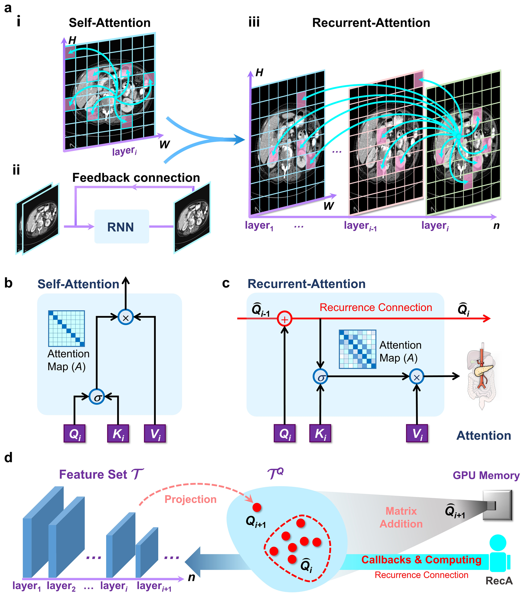

# Memory-Attention
This is the code base for **`"Enhancing your attention to memorize more information for multimodal medical image segmentation"`**, and the article is submitted to **`Information Fusion`**.

## Abstract
In this work, we first summarize the particular challenges of the medical image segmentation task. Secondly, summarize how deep neural network models can cope with that challenge. Finally, we give an effective solution.
The main research contents of this paper are as follows:

(i) `Inspired by WCWMM`, we propose a `human-like memory and action method` called **`Memory-Attention Mechanism (MAM)`** for the first time, using **`abstract cognitive-behavioral theories`** as the guiding idea for model design and introducing the concept of **`working memory`** into deep learning for the first time. **`see Fig1`**. 

(ii) MAM mimics the `human visual cognitive system at the functional level` and realizes **`the efficient coupling of the ability to extract local detailed features and establish global information dependencies in computational theory`**, thus improving the performance of multimodal medical image segmentation models. Furthermore, `incorporating memory allows` **`MAM to creatively express long-distance dependencies at the pixel level between distinct layers throughout time (see Fig2)`**.

(iii) `Attention in MAM is obtained through` **`the comprehensive integration and analysis of the memory of all previous network layers with the information of the current layer`**. Thus, MAM can compensate for the precise information that may be overlooked `when building long-distance dependencies through memory recall and retrieval`. Furthermore, MAM is **`exceedingly topological`**, allowing for the seamless replacement of the Self-Attention Mechanism (SAM) in SAM-based models and **`using SAM's pre-training weights`**, effectively mitigating the issues caused by **`computational resources and model migration`**.

(iv) To adapt the Sequential Architecture and the Hierarchical Architecture Transformers, we propose the **`Sequential Transmission Strategy (STS)`**, which emphasizes memory sharing and integration, and the **`In-Stage Transmission Strategy (ISTS)`**, which emphasizes specialized processing of memories of different dimensions, respectively. It is worth noting that `ISTS` uses **`a divide-and-conquer strategy`** `that is more in line with the information-processing mechanism of the human brain.` **`see Fig3`**.

(v) To validate the state-of-the-art of MAM, we built hybrid and pure Transformer architecture models based on MAM, and we ran controlled tests on **`2D and 3D medical image datasets`** from various modalities. Finally, we conducted a detailed ablation investigation on each important memory concept MAM gave to verify its **`scientific validity`** properly. see Tables 1 to 5.

## Results
**To learn more detail please read our paper**.
### Comparison experiments
The results of the quantitative comparison between the SAM-based model and the MAM-based model are in the Synapse dataset. `Notice that here we only show part of the experimental results, for the complete experimental results please refer to our paper.`

The results of the Synapse dataset.
| Methods  | DSC(%)↑ | HD(mm)↓ | Aorta(%) | Gallbladder(G)(%) |  Kidney(L)(%) | Kidney(R)(%) | Liver(%) | Pancreas(%) | Spleen(%) | Stomach(%) |
| :---: | :---: | :---: | :---: | :---: | :---: | :---: |  :---: | :---: | :---: | :---: |
| Swin-Unet | 77.6	|25.2|	86.2|	66.4	|82.3	|75.4	|93.9	|56.4	|88.4	|71.7|
| Swin-Unet-MAM | 78.6|	23.3	|85.6	|63.6	|84.5	|79.7	|94.0	|58.6	|89.7	|73.4|
| DA-TransUnet | 79.6|	29.1|	87.3|	62.6|	83.1|	79.9|	94.3|	63.3|	86.6|	79.5|
| DA-TransUnet-MAM | **80.9**|	**25.0**|	87.4|	64.6|	84.6|	82.1|	94.8|	63.2|	89.5|	81.0|

The results of the FLARE 2021(3D) dataset.
| Methods  | #param(M) | FLOPs(G) | DSC(%)↑ | Spleen(%) |  Kidney(%) | Liver(%) | Pancreas(%) | 
| :---: | :---: | :---: | :---: | :---: | :---: | :---: |  :---: |
| nnFormer | 149.3	|240.2	|88.7	|97.3	|94.9	|94.9	|67.6|
| nnFormer-MAM | 149.3|	240.2|	89.9|	97.2|	95.5|	96.8|	70.1|
| SwinUNETR | 62.2	|328.4	|92.7	|97.7	|95.9	|96.9	|80.3|
| SwinUNETR-MAM |62.2	|328.4	|93.3	|97.8	|96.5	|97.3	|81.6|

### Ablation experiments

**To learn more detail please read our paper**.

 We conducted a detailed ablation investigation on each important memory concept MAM gave to verify its scientific validity properly. At the same time, we demonstrate that **the memory mechanism in MAM is essentially different from the residual connectivity mechanism in terms of the sensitivity of the data distribution**. `Notice that here we only show part of the experimental results, for the complete experimental results please refer to our paper.`

The results of experiments on the memory transmission strategies in different transformer structures.
  | Memory Transmission Strategies  | Label | Encoder | Decoder | #param(M) |  FLOPs(G) | DSC(%)↑ | HD(mm)↓ | 
| :---: | :---: | :---: | :---: | :---: | :---: | :---: |  :---: |
| No MAM | Baseline 5	|-	|-	|41.3	|8.7	|77.60	|25.19|
| STS | Model 5-1|	√|	-|	41.7	|8.8|	77.68	|23.94|
| STS | Model 5-2	|√	|√	|44.4|	9.1	|76.74	|23.96|
| ISTS |Model 5-3	|√|	-	|41.3	|8.7	|78.63	|23.25|
| ISTS |Model 5-4	|√	|√	|41.3	|8.7	|78.17	|27.04|

 

## Train and Test
We have provided detailed instructions for model training and testing and experimental details. You can click the link below to view them.
* [DA-TransUnet-MAM ](DATransUnet-MAM/)
* [SwinUnet-MAM ](SwinUnet-MAM/)
* [SwinUNETR-MAM & nnFormer-MAM ](SwinUNETR&nnFormer-MAM/) 

## Citation
